# dm41xm

 

This program is used in conjunction with the DM41X calculator.
For more information about the DM41X, see https://www.swissmicros.com

The program extracts an ASCII XM file from a DM41X state file.

Usage: 41x [options]
    -f, --file DM41X-file            Specify the DM41X file you want to extract from
    -a, --ascii ASCII-file           Specify the XM ASCII file you want to extract
    -h                               Display SHORT help text
        --help                       Display LONG help text

Example: 41x -f mystatefile.d41 -a MYFILE

This would extract the XM ASCII file "MYFILE" from the statefile "mystatefile.d41".

Version: 0.1 (2020-03-27)
License: Public domain

